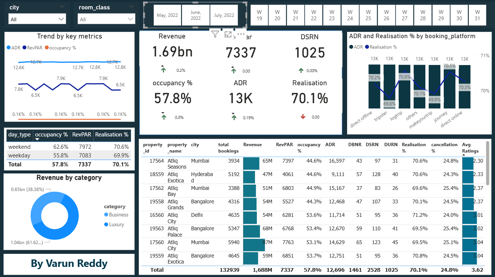

# Hotel Data Analysis

This is my first data analytics project where I analyzed hotel booking data.

I worked on understanding key metrics like revenue, occupancy, ADR, RevPAR and other performance indicators used in the hotel industry.

## What I Did

- Cleaned and prepared the dataset
- Created dashboard using Power BI
- Analyzed trends across cities and properties
- Compared weekday vs weekend performance
- Checked booking platforms and realization %

## Key Insights

- Revenue and occupancy vary across cities and properties
- Weekend occupancy is higher than weekdays
- Different booking platforms have different realization %
- Some properties perform better in terms of ratings and revenue

## Dashboard

I created an interactive Power BI dashboard showing:
- Revenue, ADR, RevPAR, Occupancy %
- Booking trends
- Platform-wise performance
- Property-level insights

(Screenshot added below)

## Files

- `hotel_analysis.pbix` → Power BI dashboard file
- Dataset → (if included or mention source)

## Tools Used

- Power BI
- Excel / CSV dataset

